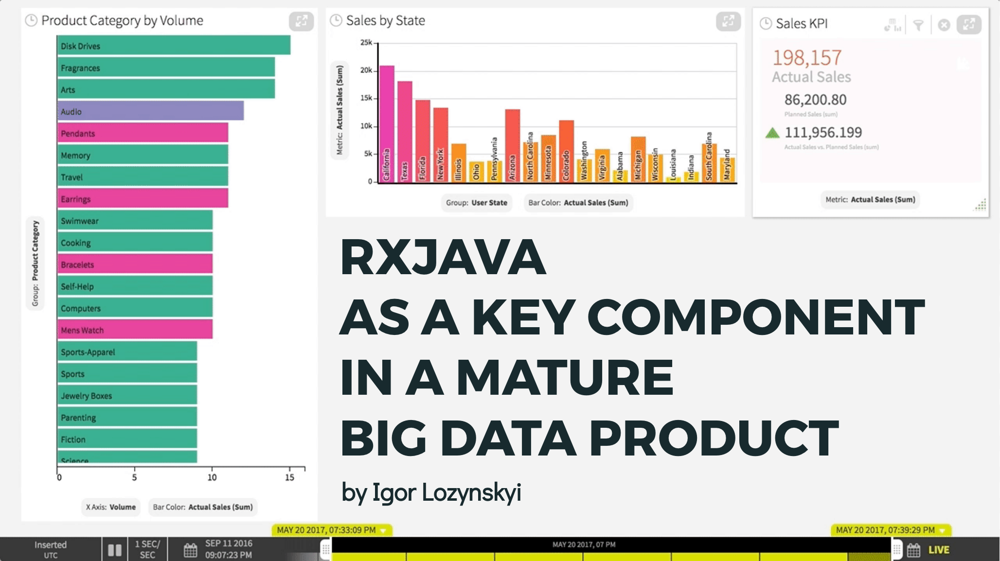
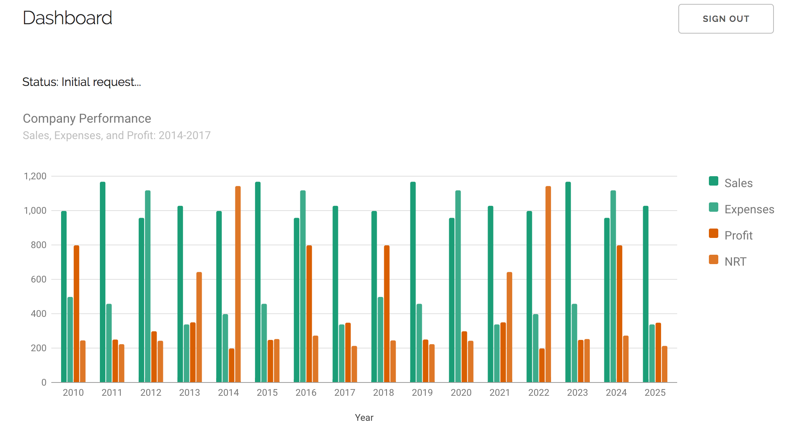

## RxJava as a key component in mature Big Data product

Small application that demonstrate Reactive approaches for Big Data visualization.

This is a demo application for presentation given on [JEEConf-2017](http://jeeconf.com). Short description of the presentation is [here](http://jeeconf.com/program/rxjava-as-key-component-in-a-mature-big-data-product/).

---

[Presentation lives here (on SlideShare)](https://www.slideshare.net/secret/4NFC0dun3dJ4Zn)

[](https://www.slideshare.net/secret/4NFC0dun3dJ4Zn)

---

#### Short description

This application simulates process of query execution in Big Data product.



It uses WebSocket for client-server communication & [RxJava](https://github.com/ReactiveX/RxJava/tree/1.x) library for asynchronous workflow.
It is based on [Spring Boot 2](https://github.com/spring-projects/spring-boot/wiki/Spring-Boot-2.0-Release-Notes) & [SpringFramework 5](https://spring.io/blog/2016/09/22/new-in-spring-5-functional-web-framework) (both are not GA yet). 
Application uses [WebFlux](https://spring.io/blog/2017/02/23/spring-framework-5-0-m5-update) framework for REST & WebSocket. UI components uses [Google Charts](https://developers.google.com/chart/). 
UI design is based on CSS framework [Skeleton](http://getskeleton.com/)

---

#### Build & run 

To build application you need ```JDK 1.8``` to be installed on your environment.

To run application you have to go into project root folder & run next command in terminal:
```mvn spring-boot:run```

After successful start application will be accessible on url: ```http://localhost:8080```.

---

#### Application Notices

- Spring Boot Actuator base url: ```/application```